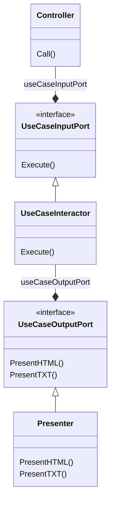

- Controller and Presenter are both in a outer layer

```mermaid
classDiagram
class UseCaseInputPort {
  <<interface>>
  Execute()
}
class UseCaseOutputPort {
  <<interface>> 
  PresentHTML()
  PresentTXT()
}
class Presenter {
  PresentHTML()
  PresentTXT()
}
class Controller {
  Call()
}
class UseCaseInteractor {
  Execute()
}
Controller --* UseCaseInputPort: useCaseInputPort
UseCaseInputPort <|-- UseCaseInteractor
UseCaseInteractor --* UseCaseOutputPort: useCaseOutputPort
UseCaseOutputPort <|-- Presenter
```
