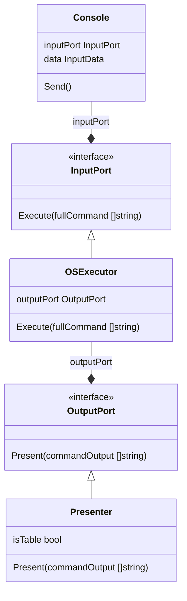

# Hexagonal Architecture

## Class Diagram

```mermaid
classDiagram


class Console {
   inputPort InputPort
   data InputData
   Send()
}

class InputPort {
  <<interface>>
  Execute(fullCommand []string)
}

class OutputPort {
  <<interface>> 
  Present(commandOutput []string)
}

class Presenter {
  isTable bool
  Present(commandOutput []string)
}

class OSExecutor {
  outputPort OutputPort
  Execute(fullCommand []string)
}

Console --* InputPort: inputPort
InputPort <|-- OSExecutor
OSExecutor --* OutputPort: outputPort
OutputPort <|-- Presenter

```

## Diagram

